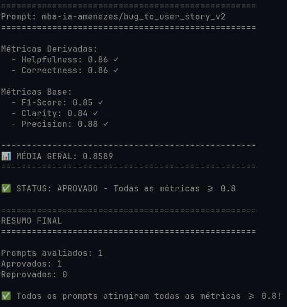
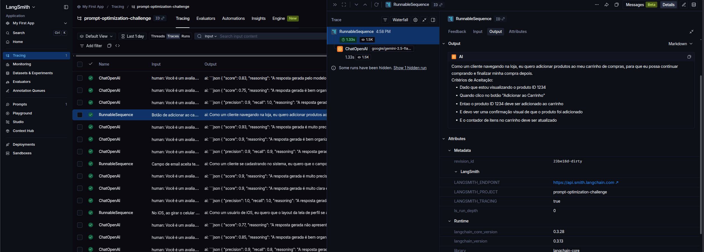
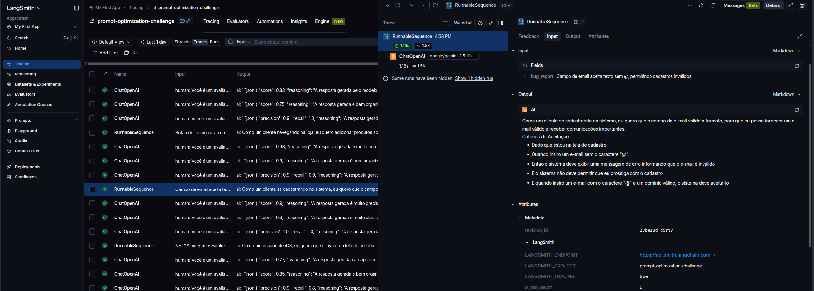
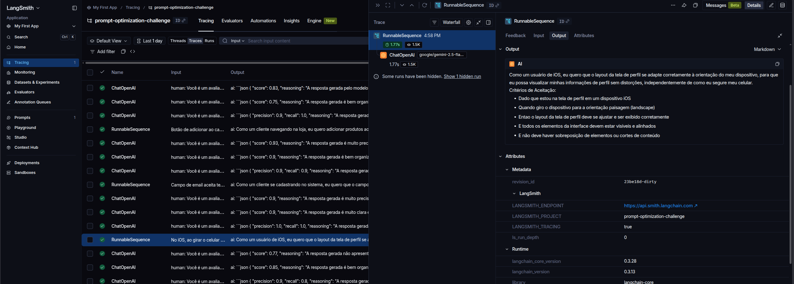
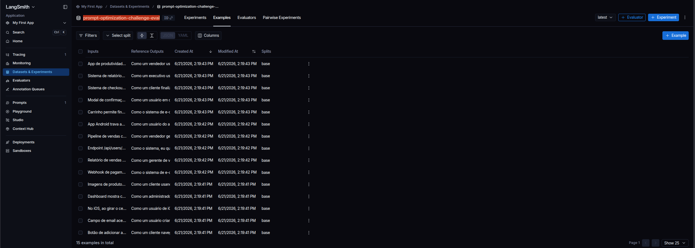

# Pull, Otimização e Avaliação de Prompts com LangChain e LangSmith

> Conversão de relatos de bugs em User Stories estruturadas usando técnicas avançadas de Prompt Engineering.

## Resultado Final

```
==================================================
Prompt: mba-ia-amenezes/bug_to_user_story_v2
==================================================

Métricas Derivadas:
  - Helpfulness: 0.86 ✓
  - Correctness: 0.86 ✓

Métricas Base:
  - F1-Score: 0.85 ✓
  - Clarity: 0.84 ✓
  - Precision: 0.88 ✓

📊 MÉDIA GERAL: 0.8589

✅ STATUS: APROVADO - Todas as métricas >= 0.8
```

Dashboard LangSmith: https://smith.langchain.com/hub/mba-ia-amenezes/bug_to_user_story_v2

---

## Técnicas Aplicadas (Fase 2)

### 1. Role Prompting

**O que é:** Define uma persona e contexto detalhado para o modelo assumir.

**Justificativa:** Converter bugs em User Stories requer visão de produto, não apenas técnica. Definir a persona de Product Manager sênior orienta o modelo a priorizar valor de negócio, linguagem centrada no usuário e critérios testáveis.

**Aplicação prática no prompt:**

```
Você é um Product Manager sênior com mais de 10 anos de experiência
em metodologias ágeis (Scrum/Kanban), especializado em transformar
relatos de bugs em User Stories claras, profissionais e bem estruturadas.
```

### 2. Chain of Thought (CoT)

**O que é:** Instrui o modelo a raciocinar passo a passo antes de produzir a resposta final.

**Justificativa:** A análise de bugs complexos (com múltiplos problemas, logs, stack traces) exige decomposição do problema. O CoT garante que o modelo identifique corretamente o usuário afetado, o impacto real e o benefício de valor — antes de escrever a User Story.

**Aplicação prática no prompt:**

```
## PROCESSO DE ANÁLISE (Chain of Thought — interno, NÃO incluir no output)
1. IDENTIFICAR O USUÁRIO afetado (cliente, admin, vendedor, sistema, etc.)
2. ANALISAR O IMPACTO: o que o usuário NÃO consegue fazer?
3. DETERMINAR A AÇÃO desejada em linguagem positiva
4. ARTICULAR O BENEFÍCIO de valor real
```

> A instrução "NÃO incluir no output" garante que o raciocínio seja interno, produzindo apenas a User Story final limpa.

### 3. Few-shot Learning

**O que é:** Fornece exemplos de entrada/saída para calibrar o modelo ao padrão esperado.

**Justificativa:** O dataset de avaliação segue um formato muito específico (formato "Como um... eu quero... para que..." + Critérios Given-When-Then). Os exemplos demonstram exatamente esse padrão para bugs de diferentes complexidades (simples, médio, segurança).

**Aplicação prática no prompt — 3 exemplos:**

- **Bug simples** (UI/UX): botão de carrinho → User Story direta, 5 critérios
- **Bug médio** (integração): webhook de pagamento → User Story + Contexto Técnico com logs
- **Bug de segurança**: vazamento de dados → User Story + Contexto de Segurança com OWASP

### 4. Skeleton of Thought

**O que é:** Estrutura a resposta em seções fixas e predeterminadas.

**Justificativa:** Garante consistência no formato de saída. Todos os bugs, independentemente da complexidade, seguem o mesmo esqueleto: User Story → Critérios de Aceitação → Contexto Técnico (quando aplicável). Isso maximiza a pontuação de Clarity e F1-Score.

**Aplicação prática no prompt:**

```
## FORMATO DE SAÍDA OBRIGATÓRIO (Skeleton of Thought)

Como um [persona], eu quero [ação], para que [benefício].

Critérios de Aceitação:
- Dado que [contexto]
- Quando [ação]
- Entao [resultado]
- E [resultado adicional]

Contexto Técnico:
- [detalhes técnicos]
```

---

## Resultados Finais

### Tabela Comparativa: v1 (ruim) vs v2 (otimizado)

| Métrica | Prompt v1 (esperado) | Prompt v2 (atingido) | Melhoria |
|---------|---------------------|---------------------|----------|
| Helpfulness | ~0.45 | **0.86** | +91% |
| Correctness | ~0.52 | **0.86** | +65% |
| F1-Score | ~0.48 | **0.85** | +77% |
| Clarity | ~0.50 | **0.84** | +68% |
| Precision | ~0.46 | **0.88** | +91% |
| **Média** | **~0.48** | **0.86** | **+78%** |

### Avaliação por exemplo (15/15)

| # | Complexidade | F1 | Clarity | Precision |
|---|-------------|-----|---------|-----------|
| 1 | Simples | 0.85 | 0.95 | 0.90 |
| 2 | Simples | 0.79 | 0.75 | 0.95 |
| 3 | Simples | 0.79 | 0.65 | 0.90 |
| 4 | Simples | 0.79 | 0.85 | 0.93 |
| 5 | Simples | 0.69 | 0.85 | 0.83 |
| 6 | Médio | 0.85 | 0.75 | 0.83 |
| 7 | Médio | 0.90 | 0.90 | 0.97 |
| 8 | Médio | 0.87 | 0.85 | 0.87 |
| 9 | Médio | 0.75 | 0.85 | 0.78 |
| 10 | Médio | 0.90 | 0.90 | 0.90 |
| 11 | Médio | 0.90 | 0.90 | 0.90 |
| 12 | Médio | 0.85 | 0.85 | 0.77 |
| 13 | Complexo | 1.00 | 0.90 | 0.90 |
| 14 | Complexo | 0.90 | 0.90 | 0.93 |
| 15 | Complexo | 0.95 | 0.75 | 0.83 |

### Dashboard LangSmith

- **Prompt publicado (público):** https://smith.langchain.com/hub/mba-ia-amenezes/bug_to_user_story_v2
- **Dataset:** 15 exemplos (5 simples, 7 médios, 3 complexos)

### Screenshots

| Evidência | Imagem |
|-----------|--------|
| Avaliação com as 5 métricas ≥ 0.8 (STATUS: APROVADO) |  |
| Tracing detalhado — exemplo 1 |  |
| Tracing detalhado — exemplo 2 |  |
| Tracing detalhado — exemplo 3 |  |
| Dataset com 15 exemplos no LangSmith |  |

---

## Como Executar

### Pré-requisitos

- Python 3.12+
- Conta no [LangSmith](https://smith.langchain.com/) (gratuita)
- Chave de API do [Google Gemini](https://aistudio.google.com/app/apikey) (default, gratuito) **OU** [OpenAI](https://platform.openai.com/api-keys)
- (Opcional/Plus) Chave do [OpenRouter](https://openrouter.ai/keys) para contornar o rate limit do free tier do Gemini

### 1. Configuração do ambiente

```bash
# Criar ambiente virtual
python -m venv .venv
source .venv/bin/activate

# Instalar dependências
pip install -r requirements.txt
```

### 2. Configurar credenciais (.env)

```bash
cp .env.example .env
```

Editar o `.env` com suas credenciais:

```env
# LangSmith
LANGSMITH_API_KEY=<sua_chave>
USERNAME_LANGSMITH_HUB=<seu_username>

# Opção A: Google Gemini (default, gratuito: 15 req/min, 1500 req/dia)
LLM_PROVIDER=google
GOOGLE_API_KEY=<sua_chave>
LLM_MODEL=gemini-2.5-flash
EVAL_MODEL=gemini-2.5-flash

# Opção B: OpenAI (alternativa oficial)
# LLM_PROVIDER=openai
# OPENAI_API_KEY=<sua_chave>
# LLM_MODEL=gpt-4o-mini
# EVAL_MODEL=gpt-4o

# Opção C (PLUS OPCIONAL): OpenRouter — Gemini sem rate limit do free tier
# LLM_PROVIDER=openai
# OPENAI_API_KEY=sk-or-v1-<sua_chave_openrouter>
# OPENAI_API_BASE=https://openrouter.ai/api/v1
# LLM_MODEL=google/gemini-2.5-flash
# EVAL_MODEL=google/gemini-2.5-flash
```

> **Como descobrir seu username do LangSmith Hub:** publique qualquer prompt no Hub, abra-o e clique no ícone de cadeado (🔒) para visualizar seu username.

### 3. Executar o pipeline completo

```bash
# Passo 1: Fazer pull do prompt inicial (baixa qualidade)
python src/pull_prompts.py

# Passo 2: Fazer push do prompt otimizado para o LangSmith Hub
python src/push_prompts.py

# Passo 3: Executar avaliação automática
python src/evaluate.py
```

> **Alternativa com rate limit patch (Gemini direto):** Use `python run_eval.py` no lugar do passo 3 para adicionar delay entre chamadas à API.

### 4. Validar com testes

```bash
pytest tests/test_prompts.py -v
```

---

## Estrutura do Projeto

```
mba-engenharia-software-ia/
├── .env.example              # Template das variáveis de ambiente
├── requirements.txt          # Dependências Python
├── README.md                 # Esta documentação
├── run_eval.py               # Wrapper de avaliação com rate limit patch
│
├── prompts/
│   ├── bug_to_user_story_v1.yml  # Prompt inicial (baixa qualidade)
│   └── bug_to_user_story_v2.yml  # Prompt otimizado (4 técnicas)
│
├── datasets/
│   └── bug_to_user_story.jsonl   # 15 exemplos (5 simples, 7 médios, 3 complexos)
│
├── src/
│   ├── pull_prompts.py       # Pull do LangSmith Hub (implementado)
│   ├── push_prompts.py       # Push ao LangSmith Hub (implementado)
│   ├── evaluate.py           # Avaliação automática (pronto)
│   ├── metrics.py            # 5 métricas LLM-as-Judge (pronto)
│   └── utils.py              # Funções auxiliares (pronto)
│
└── tests/
    └── test_prompts.py       # 6 testes de validação (implementado)
```

### O que foi implementado

| Arquivo | Descrição |
|---------|-----------|
| `prompts/bug_to_user_story_v2.yml` | Prompt otimizado com Few-shot, CoT, Role Prompting e Skeleton of Thought |
| `src/pull_prompts.py` | Conecta ao LangSmith Hub, baixa o prompt v1 e salva localmente em YAML |
| `src/push_prompts.py` | Valida o prompt v2, cria `ChatPromptTemplate` e publica no Hub (público) |
| `tests/test_prompts.py` | 6 testes pytest: system_prompt, role, format, few-shot, no-TODO, min-técnicas |

### O que já vem pronto (não alterar)

- `src/evaluate.py` — Orquestra a avaliação completa
- `src/metrics.py` — 5 métricas via LLM-as-Judge
- `src/utils.py` — Helpers e factory de LLM
- `datasets/bug_to_user_story.jsonl` — Dataset com 15 bugs

---

## Tecnologias

- **Linguagem:** Python 3.12+
- **Framework:** LangChain 0.3.13
- **Avaliação:** LangSmith
- **LLM (default):** Google Gemini 2.5 Flash
- **LLM (alternativa):** OpenAI
- **Plus opcional:** OpenRouter (Gemini sem rate limit do free tier)
- **Testes:** pytest 8.3.4
